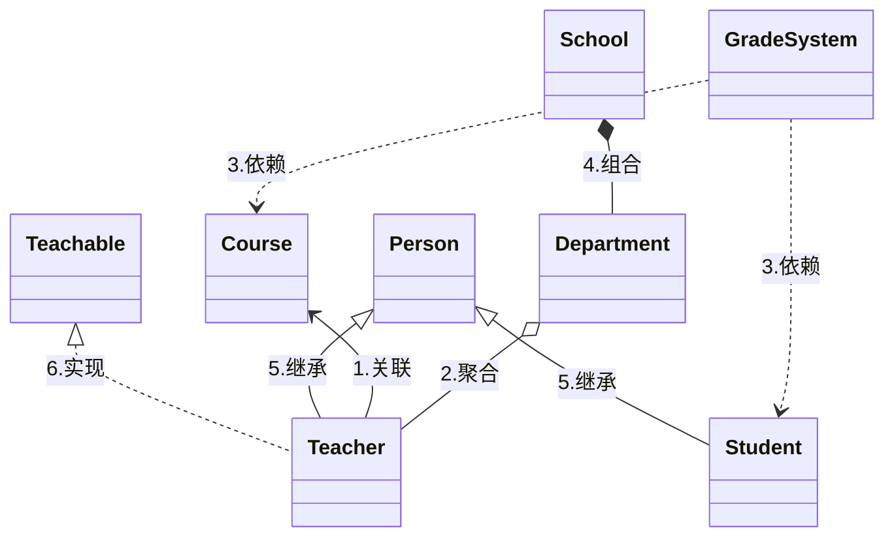

## 组件说明

### Agent
> 负责决策和执行任务，是系统的智能核心
- base.py：定义了BaseAgent基类，包括状态管理、内存管理和执行循环
- browser.py：实现了浏览器相关的代理功能，用于网页交互
- manus.py：实现了Manus主代理，集成了多种工具能力的核心代理
- mcp.py：实现了MCP(Manus Control Protocol)代理，用于控制协议相关功能
- react.py：实现了ReAct模式的代理，基于推理-行动循环模式
- swe.py：实现了软件工程(SWE)相关的代理，专注于代码生成和分析
- toolcall.py：实现了工具调用代理，负责管理和执行各种工具

{/* truncate */}
### Flow

### Mcp

