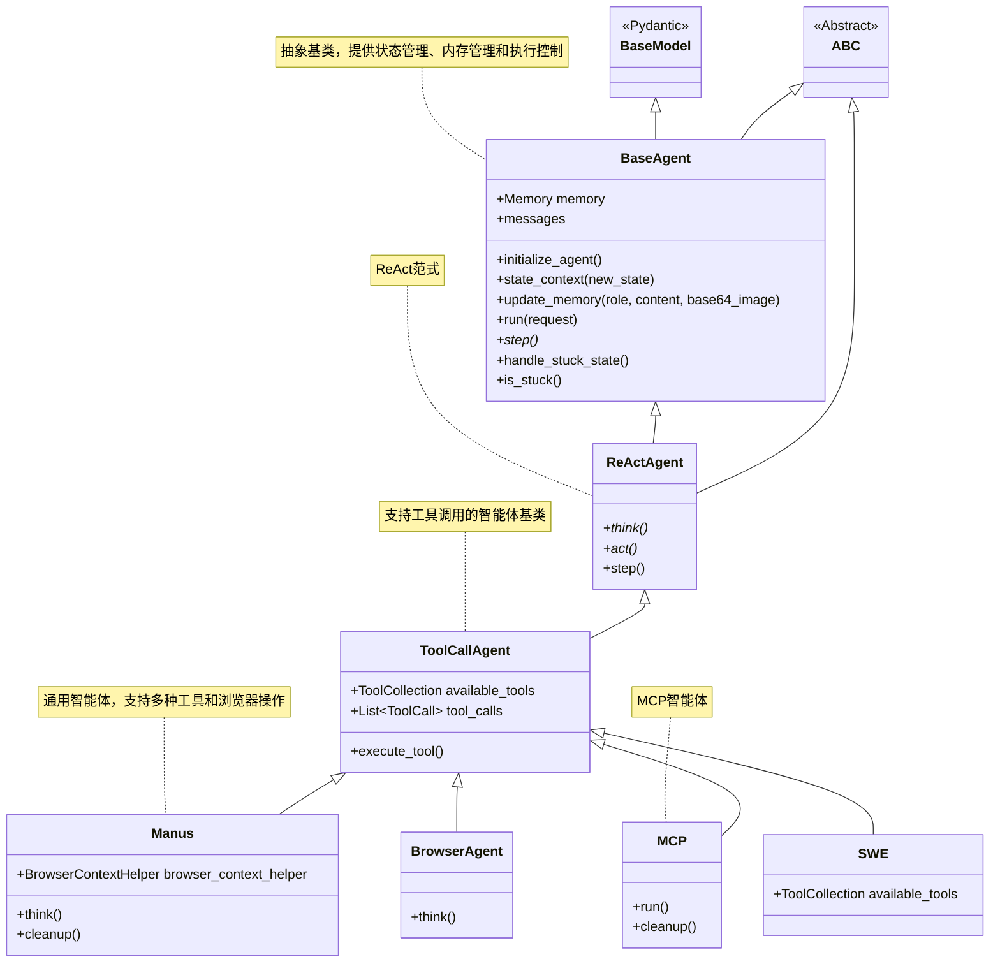

## 初心
随着DeepSeek的爆火，当看到大量LLM API出现之后，自己也萌生了接触prompt engineering，开发LLM应用的想法，虽然国内调用gemini很麻烦，但是还是有几个大厂的ds api看上去还是廉价可口，
于是想找几个LLM应用学习一下，并且搞明白几个问题：
1. LLM如何保证可靠性
2. 提示词的使用技巧
3. 如何减少上下文占用的token
4. LLM如何调用其他工具

## 学习OpenManus

### Agent
> 负责决策和执行任务，是系统的智能核心
- base.py：定义了BaseAgent基类，包括状态管理、内存管理和执行循环
    * run()：执行循环，调用step()执行步骤，调用is_stuck()排查是否陷入重复循环。
    * update_memory()：存储上下文，图片和消息
    * state_context()：状态管理
- react.py：实现了ReAct模式的智能体，基于推理-行动循环模式
    * 定义了step()的实现：先思考再执行，然后把具体的think()和act()交给子类
- toolcall.py：实现了工具调用智能体，负责管理和执行各种工具
    * 实现了think()和act()
- browser.py：实现了浏览器相关的代理功能，用于网页交互
    * 重写了think()，在调用父类think之前，填充上下文和提示词
- manus.py：实现了Manus主智能体
- mcp.py：实现了MCP(Manus Control Protocol)智能体，MCP是一个和LLM交互的协议，有待深入了解
- swe.py：实现了软件工程(SWE)相关的智能体，在toolcall的基础上配备了与操作系统交互，与代码交互的工具

{/* truncate */}
### Flow

* base.py：提供了对智能体的管理
* flow_factory.py：工厂类，用于创建flow，目前只支持planning类型
* planning.py：基于计划的flow，大致上是从数组中依次找到对应类型的智能体去执行

### Mcp

todo 暂时觉得是高级的tool

### Prompt
#### 角色定位
> SETTING: You are an autonomous programmer, and you're working directly in the command line with a special interface.   
> 您是一名自主程序员，并且您正在使用特殊界面直接在命令行中工作

#### 任务分解
> Your job is:
> 1. Analyze requests to understand the task scope
> 2. Create a clear, actionable plan that makes meaningful progress with the `planning` tool
> 3. Execute steps using available tools as needed
> 4. Track progress and adapt plans when necessary
> 5. Use `finish` to conclude immediately when the task is complete

> 你的工作是：
> 1. 分析请求，了解任务范围
> 2. 使用“planning”工具制定清晰、可操作的计划，确保取得有意义的进展
> 3. 根据需要使用可用工具执行步骤
> 4. 跟踪进度并在必要时调整计划
> 5. 使用“完成”按钮在任务完成后立即结束

#### 通过反问引导
> Based on the current state, what's your next action?
> Choose the most efficient path forward:
> 1. Is the plan sufficient, or does it need refinement?
> 2. Can you execute the next step immediately?
> 3. Is the task complete? If so, use `finish` right away.

> 根据当前状态，你的下一步行动是什么？
> 选择最有效的前进路径：
> 1. 计划是否充分，还是需要改进？
> 2. 你能立即执行下一步吗？
> 3. 任务完成了吗？如果完成了，请立即使用“finish”。

#### 限制
> Note that the environment does NOT support interactive session commands (e.g. python, vim)   
> 请注意，该环境不支持交互式会话命令（例如 python、vim）

## 问题回答
1. LLM如何保证可靠性
2. 如何减少上下文占用的token
    * 向量化？
    * 通过应用层，比如减少不必要的工具输入，压缩上下文
3. LLM如何调用其他工具
    * 一般情况下，LLM API 会提供相关的支持，比如说在chat请求里添加tool这么一个参数，提供结构化的输入输出，但是工具的功能和参数的含义还是用自然语言

