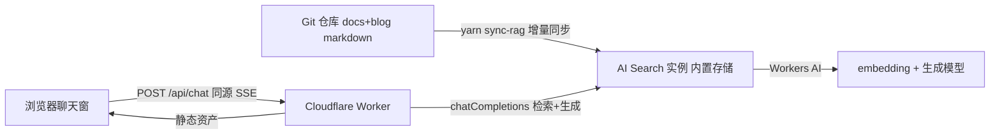

# 给静态博客接入 RAG 问答:Cloudflare 一把梭实战

本站右下角的聊天助手(以及 [/chat](/chat) 页面)就是这套方案的成品:提问后它检索全站文章、流式生成回答、给出可点击的来源引用,支持多轮追问。整套系统**没有一台自建服务器**,全部跑在 Cloudflare 上,月成本约等于零。

这篇教程记录完整的技术栈、实现流程和踩过的坑。前身是一套 Spring Boot + ChromaDB 的自建 RAG(FileRAG),需要常驻服务器和定时向量化任务,服务器一挂全灭——迁移到托管方案后,这些运维负担全部消失。

## 一、架构总览



分工:

| 组件 | 职责 |
|---|---|
| **Cloudflare AI Search**(原 AutoRAG,免费 beta) | 托管 RAG 的全部脏活:切片、embedding、向量索引、混合检索、查询重写、调用生成模型 |
| **Cloudflare Worker**(与静态站同一个) | 静态资产 + `/api/chat` 聊天接口 + `/api/rag/*` 知识库管理接口 |
| **同步脚本**(`scripts/sync-knowledge.mjs`) | 把仓库里的 markdown 增量推给 AI Search,处理新增/修改/删除 |
| **前端组件**(React) | 浮窗 + 独立聊天页,SSE 流式渲染、行内引用角标 |

关键设计决策:

1. **聊天 API 和静态站同源**(一个 Worker 全包):没有 CORS、没有额外域名、没有 mixed content。
2. **选托管(AI Search)而非自建(Vectorize + D1 手工缝合)**:自建要自己处理切片、双库一致性、增量对账、幂等——托管方案把这些全部内化,代价是黑盒出 bug 只能绕(后文有实例)。
3. **数据源选"内置存储 + Items API"而非 R2 bucket**:上传即索引(R2 源是 6 小时一次的 sync job)、不需要在 dashboard 手动创建 service token、少管理一个 bucket。内容的唯一事实源本来就是 git 仓库。

## 二、创建 AI Search 实例

wrangler 绑定(`wrangler.jsonc`):

```jsonc
{
  "main": "worker/index.js",
  "assets": { "directory": "build", "binding": "ASSETS", "not_found_handling": "404-page" },
  "ai_search_namespaces": [
    { "binding": "AI_SEARCH", "namespace": "default", "remote": true }
  ]
}
```

实例创建做成了 Worker 里的幂等接口(`POST /api/rag/setup`),每次同步前都会执行,配置以代码为唯一事实源:

```js
const config = {
  embedding_model: '@cf/qwen/qwen3-embedding-0.6b', // 多语言,8k 输入;建索引后不可更换
  ai_search_model: '@cf/qwen/qwen3-30b-a3b-fp8',    // 生成模型,可随时换
  chunk_size: 512,
  chunk_overlap: 15,                                 // 注意:百分比(0-30),不是 token 数
  index_method: { vector: true, keyword: true },     // 混合检索
  indexing_options: { keyword_tokenizer: 'trigram' },// trigram 对中日文关键词友好
  custom_metadata: [
    { field_name: 'md5', data_type: 'text' },        // 增量同步用
    { field_name: 'url', data_type: 'text' },        // 文章真实 permalink
  ],
};
await env.AI_SEARCH.create({ id: 'kibou-rag', ...config });
```

选型要点:

- **embedding 用多语言模型**(qwen3-embedding,8k token 输入)。中文内容配英文模型或短输入模型(如 512 token 的模型配 1800 字中文分块)会被静默截断,检索质量打对折。
- **混合检索必开**:纯向量检索对专有名词(人名、产品名、"春琴抄")很弱,BM25 关键词精确命中能救回来;`trigram` 分词器对中文是刚需。

## 三、知识库怎么和仓库保持同步

同步脚本每次跑"三方对账":本地文件树(期望状态)、远端 items 列表(实际状态)、内容 md5(变更检测)。

- **改了文章** → md5 变化 → 同 key 重新上传,AI Search 整篇替换重索引;
- **删了文章** → 远端多出来 → 按 item id 删除,向量一并清理;
- **新增/重命名** → 上传新 key(重命名等于删旧增新);
- **无状态**:md5 存在 item 的自定义 metadata 里,不依赖本地清单文件,本地、CI、任何机器跑结果一致,漏跑一次也能自愈。

两个容易被忽略、但决定问答质量的细节:

**1. 注入元数据头。**标题和日期往往只存在于文件名里(比如 `blog/2025-03-17-两个人的话,去1912散步也是可以的.mdx`,正文通篇没有"1912"两个字)。只索引正文的话,"作者哪天去了1912?"这类问题既检索不到也答不出。同步时在正文前注入一行:

```
[文档信息] 标题: 两个人的话,去1912散步也是可以的 | 日期: 2025-03-17 | 位置: blog
```

标题和日期就进了分块,再配合系统提示词教模型使用这一行,日期类问题就能答了。

**2. 来源链接用构建元数据,别用文件路径拼。**Docusaurus 会剥离目录的数字前缀(`03-建站与OnPage` → `建站与OnPage`)、应用 frontmatter slug,拿文件路径猜 URL 必然 404。正确做法:从 `.docusaurus/` 构建产物里读每篇文章的真实 permalink,作为 `url` metadata 存进索引,前端直接用。

## 四、聊天接口:一次问答的完整链路

Worker 端核心就一个调用:

```js
const upstream = await env.AI_SEARCH.get('kibou-rag').chatCompletions({
  messages: [{ role: 'system', content: SYSTEM_PROMPT }, ...history],
  stream: true,
  ai_search_options: {
    retrieval: { max_num_results: 8, filters },      // filters 可按 folder 前缀限定 docs/blog
    query_rewrite: { enabled: history.length > 1, rewrite_prompt },
  },
});
```

AI Search 内部依次做:查询重写(多轮时把"继续""它是什么"结合历史改写成独立检索句)→ 混合检索 → 把命中分块作为上下文喂给生成模型 → 流式返回。上游 SSE 里**分块先到、文字后到**,Worker 把它转译成前端友好的精简协议:

```
event: sources
data: {"sources":[{filePath,fileName,url,snippet,score}...],"refMap":{"1":1,"3":2}}

data: {"delta":"MySQL"}
data: {"delta":" 的隔离级别"}
data: [DONE]
```

`refMap` 是行内引用的关键:系统提示词要求模型引用材料时标注 `[n]`(n 是分块序号),但展示时来源按文件去重过,refMap 负责把"分块编号"换算成"来源编号",前端再把 `[n]` 渲染成可点击的角标,点击直达原文。

多轮对话是**无状态**设计:前端每次把完整消息历史(截最近 16 条)发给后端,服务端不存会话——没有 KV、没有 session 超时清理,换来的是零状态运维。

## 五、前端

- 浮窗(全站右下角)和独立聊天页(/chat)共用一个 `useChat` hook(状态 + SSE 解析)和 `ChatMessages` 组件(渲染 + 滚动);
- **来源纸片放在回答上方**:流式输出时文字在气泡底部增长,自动滚动跟随时看到的才是正在生成的内容(放下方的话视口会一直卡在引用区);
- **智能滚动**:只有用户本来就停在底部附近才跟随,上翻阅读时不打断;
- `react-markdown` 默认不渲染表格——GFM 扩展语法需要挂 `remark-gfm` 插件,否则模型输出的规范表格会被折叠成一行竖线。

## 六、生成模型选型(实测)

同一检索管线下 A/B 三个 Workers AI 模型(2026-07,中文内容):

| 模型 | 质量 | 可靠性 | 价格(入/出 每 M token) |
|---|---|---|---|
| `qwen3-30b-a3b-fp8` ✅ | 中文最好,结构清晰 | 稳定,稍慢(思考型) | $0.051 / $0.335 |
| `llama-3.3-70b-instruct-fp8-fast` | 快但偷懒,中文一般 | 稳定 | $0.293 / $2.253(贵 6 倍) |
| `glm-4.7-flash` | 不错 | **随机空回答/超时**,弃 | $0.06 / $0.40 |

单次问答(约 3.5k 输入 + 500 输出)≈ 0.0004 美元;Workers AI 每天 1 万 neurons 免费额度约可覆盖 300 次问答。AI Search 本身 beta 期免费。想上更强的模型(gemini-2.5-flash / gpt-5 系),AI Search 支持通过 AI Gateway 挂自己的 provider key。

## 七、踩坑清单

按踩到的顺序,每一个都消耗过真实的调试时间:

1. **`chunk_overlap` 是百分比**(0-30),按 token 数传 64 直接报 "Too big: expected number to be <=30"。
2. **R2 数据源需要 service API token**,只能在 dashboard 手动创建一次;用内置存储 + Items API 可完全绕开。
3. **`context_expansion`(检索时拉相邻分块)和自定义 metadata 一起用会触发后端 Internal Error**——beta 阶段的黑盒 bug,只能弃用该参数。这就是托管方案的代价:出 bug 不能修,只能绕。
4. **查询重写默认会把中文问题翻译成英文**,检索相关度明显下降,需要自定义 rewrite_prompt 强制保持原语言。
5. **首轮不要开查询重写**:没有上下文可补全时,改写只会偏移原意("作者哪天去了1912"被改写后正确文章反而掉出检索结果)。重写只在多轮追问时启用。
6. **模型不会自动使用元数据**:注入了 `[文档信息]` 行之后,模型仍会嘴硬"正文没提日期",抽象规则没用,要在系统提示词里给一个具体示例(few-shot)才学会。
7. **过滤器语法认 Mongo 风格**:`{ folder: { $gte: "blog/", $lt: "blog0" } }`(前缀匹配技巧:`0` 是 `/` 的 ASCII 下一位);文档里的旧版 compound 格式会报 Invalid input。
8. **小模型会编造引用编号**(材料只有 8 条却标 `[14]`),提示词约束 + 前端剥离超范围标记双保险。

## 八、成本与总结

- AI Search:beta 免费(免费版限额 10 万文件、2 万次查询/月);
- Workers AI:embedding + 生成,个人博客流量基本落在每日免费额度内;
- Worker / 静态资产:免费额度内;
- **总计:≈ 0 元/月**,且没有任何需要保活的服务器。

回头看,这套系统里真正值钱的不是"多了一个聊天窗",而是那条**知识流水线**:git 仓库是唯一事实源,一条命令(`yarn deploy`)完成建站、部署和知识库增量同步,新增、修改、删除都自动传播到向量索引。RAG 的答案质量七分靠检索,三分靠生成——而检索质量,几乎全部取决于你往索引里喂了什么。
