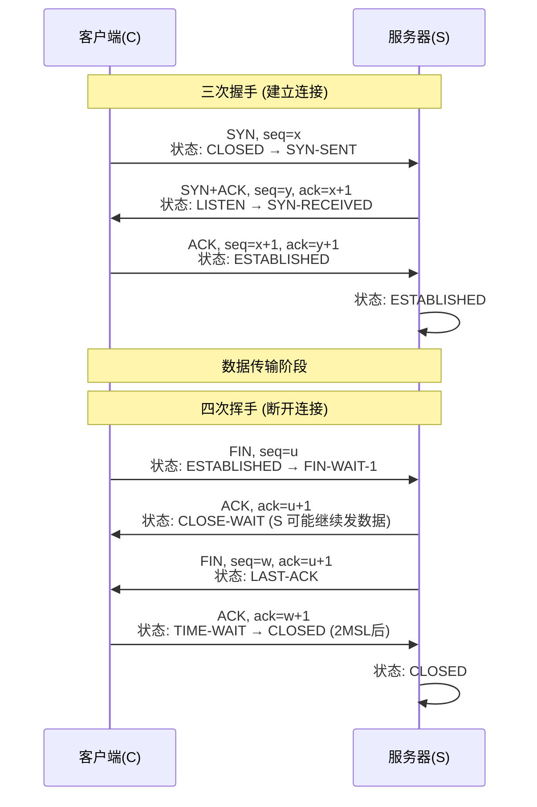

## 流程图

## 前置知识
- TCP 状态枚举

| 状态名              | 说明                  | 常见出现场景                           |
| ---------------- | ------------------- | -------------------------------- |
| **CLOSED**       | 初始/最终状态，无连接         | 连接未建立、已释放                        |
| **LISTEN**       | 监听状态，等待连接请求         | 服务端 `socket.bind()` + `listen()` |
| **SYN-SENT**     | 已发送 SYN 等待对方 ACK    | 客户端主动连接时 `connect()`             |
| **SYN-RECEIVED** | 收到 SYN 并回复 SYN+ACK  | 服务端收到连接请求后                       |
| **ESTABLISHED**  | 连接建立，数据可双向传输        | 正常通信中                            |
| **FIN-WAIT-1**   | 主动关闭，已发 FIN 等待 ACK  | 主动断开方                            |
| **FIN-WAIT-2**   | 收到对方 ACK，等待 FIN     | 主动断开方                            |
| **CLOSE-WAIT**   | 被动关闭，等待应用调用 close() | 被动断开方                            |
| **CLOSING**      | 双方几乎同时发 FIN，等待 ACK  | 少见                               |
| **LAST-ACK**     | 被动关闭方已发 FIN 等待 ACK  | 被动断开方                            |
| **TIME-WAIT**    | 主动关闭方等待 2MSL        | 防止延迟报文影响新连接                      |

- TCP 报文属性（TCP Header 字段）

| 字段                        | 长度     | 说明                      |
| ------------------------- | ------ | ----------------------- |
| **Source Port**           | 16 bit | 源端口号                    |
| **Destination Port**      | 16 bit | 目的端口号                   |
| **Sequence Number**       | 32 bit | 序列号（seq），标识本报文段第一个字节的编号 |
| **Acknowledgment Number** | 32 bit | 确认号（ack），表示期望收到的下一个字节编号 |
| **Data Offset**           | 4 bit  | TCP 头长度（以 32 位字为单位）     |
| Reserved              | 3 bit  | 保留字段（未来用途）              |
| **Flags（控制位）**            | 9 bit  | TCP 报文属性标志（见下表）         |
| Window Size           | 16 bit | 窗口大小（流量控制）              |
| Checksum            | 16 bit | 校验和（包含 TCP 头和数据）        |
| Urgent Pointer        | 16 bit | 紧急数据的偏移量                |
| Options               | 可变     | 选项字段（MSS、窗口扩大、时间戳等）     |

- TCP Flags（控制位标志）

| 标志      | 全名                        | 作用             |
| ------- | ------------------------- | -------------- |
| URG | Urgent                    | 紧急指针有效（很少用）    |
| **ACK** | Acknowledgment            | 确认号有效          |
| **PSH** | Push                      | 立即推送数据给应用层     |
| **RST** | Reset                     | 复位连接（异常中断）     |
| **SYN** | Synchronize               | 建立连接请求，同步序列号   |
| **FIN** | Finish                    | 释放连接请求         |
| ECE | ECN Echo                  | 拥塞控制（RFC 3168） |
| CWR | Congestion Window Reduced | 拥塞控制响应         |
| NS  | Nonce Sum                 | 拥塞控制增强（很少用）    |

## 三次握手
### 目的
- 双方确认对方的接收与发送能力正常（即双向通信能力 OK）。
- 交换 初始序列号（Initial Sequence Number, ISN），为后续可靠传输做准备。

### 过程

1. 第一次握手（C → S）
- C 发送一个 SYN 报文（SYN=1），并选择一个初始序列号 seq = x。
- 目的：告诉 S “我要连接你，并且我的初始序列号是 x”。
- 此时 C 状态：SYN-SENT

2. 第二次握手（S → C）
- S 收到 SYN 后，发送 SYN + ACK 报文（SYN=1, ACK=1），确认号 ack = x+1，并选择自己的初始序列号 seq = y。
- 目的：告诉 C “我收到你的请求了（ack=x+1），我也要连接你（SYN），我的序列号是 y”。
- 此时 S 状态：SYN-RECEIVED

3. 第三次握手（C → S）
- C 收到 SYN+ACK 后，发送一个 ACK 报文，确认号 ack = y+1，seq = x+1。
- 目的：告诉 S “你的序列号我收到了，可以开始传数据了”。
- 此时双方进入 ESTABLISHED 状态，可以开始数据传输。

### Q&A
- 为什么是三次握手？
    - 网络存在延迟，服务器收到的 SYN 可能是客户端很久之前发送的
    - 第三次握手是服务端确实当他收到SYN报文到时候，客户端是否还有想连接的意图
    - 防止ESTABLISHED状态进入过早

## 四次挥手

### 过程

1. 第一次挥手（C → S）

- C 发送 FIN 报文（FIN=1，seq=u）。
- 表示 “我没有数据要发了，但还能接收你的数据”。
- 状态：FIN-WAIT-1

1. 第二次挥手（S → C）

- S 收到 FIN，发送 ACK 报文（ack=u+1，seq=v）。
- 表示 “我知道你没数据要发了”。
- 此时 S 可能还有数据要发送给 C，所以暂时不发 FIN。
- 状态：C 进入 FIN-WAIT-2，S 进入 CLOSE-WAIT

3. 第三次挥手（S → C）

- S 发送完数据后，发 FIN 报文（FIN=1，seq=w，ack=u+1）。
- 表示 “我也没数据要发了”。
- 状态：S 进入 LAST-ACK

4. 第四次挥手（C → S）

- C 收到 FIN，发送 ACK（ack=w+1，seq=u+1）。
- 表示 “收到你的断开请求，连接关闭”。
- C 进入 TIME-WAIT 状态等待 2MSL（Maximum Segment Lifetime，报文最大生存时间）后彻底关闭，S 收到 ACK 后直接进入 CLOSED 状态。

### Q&A
- 为什么 TCP 挥手需要有 TIME_WAIT 状态?
    -  第四次挥手的ack报文可能丢失，如果丢失，服务端会重发FIN报文，这时候需要C端再次ACK
    -  防止被动关闭方等待超时后再断连
    -  确保网络中所有属于该连接的旧报文全部

