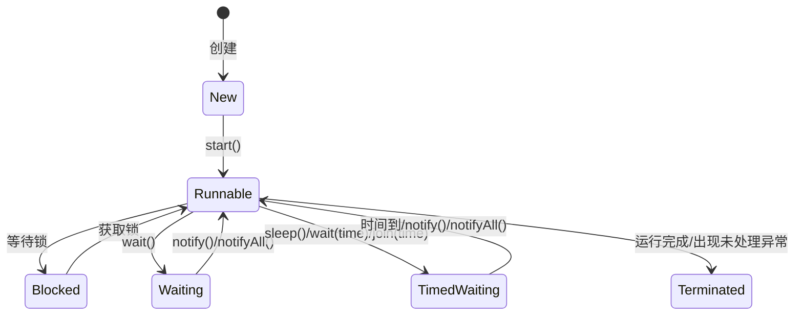

# 线程

```mermaid
stateDiagram-v2
    [*] --> New: 创建
    New --> Runnable: start()
    Runnable --> Blocked: 等待锁
    Blocked --> Runnable: 获取锁
    Runnable --> Waiting: wait()
    Waiting --> Runnable: notify()/notifyAll()
    Runnable --> TimedWaiting: sleep()/wait(time)/join(time)
    TimedWaiting --> Runnable: 时间到/notify()/notifyAll()
    Runnable --> Terminated: 运行完成/出现未处理异常


```