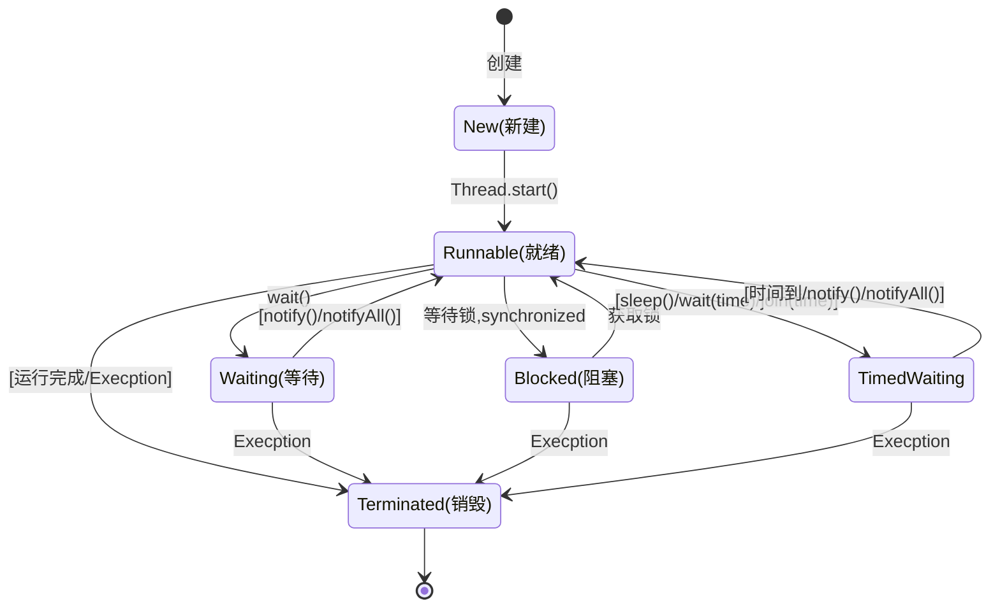

# 线程

## 线程状态

* 新建（New） 
  * 创建一个线程对象
* 就绪（Runnable）
  * start()，yield()方法，该线程处于就绪状态，等待获取cpu的使用权。
* 运行（running）
  * 可运行状态的线程获得了cpu时间片（timeslice），执行程序代码。注：就绪状态是进入到运行状态的唯一入口
* 阻塞（Blocked）
  * 等待获取阻塞锁
* 等待（Waiting）
* 超时等待（TimedWaiting）
* 死亡（Terminated）

#### 枚举

## 线程创建方式