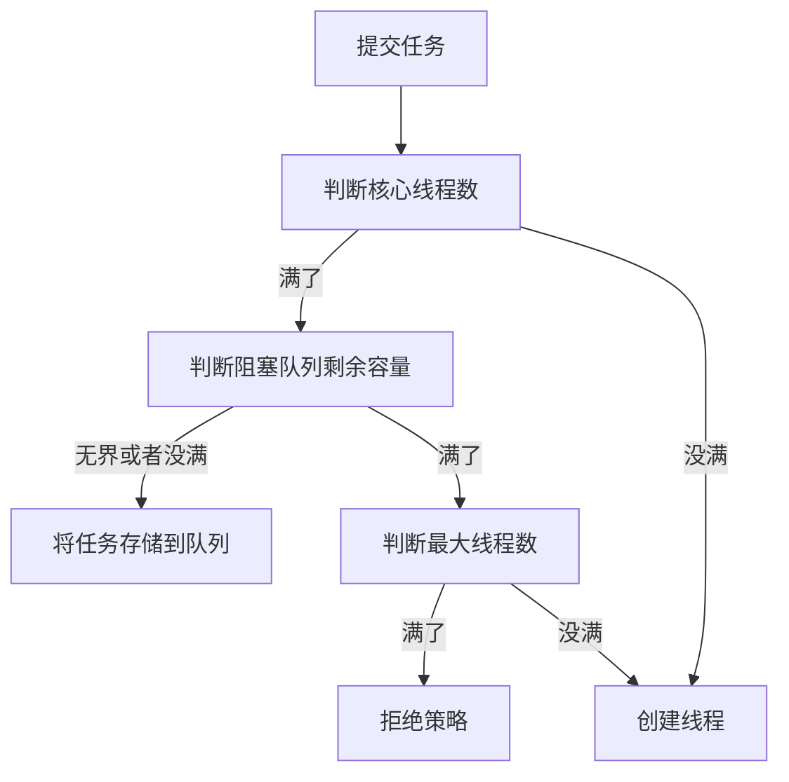
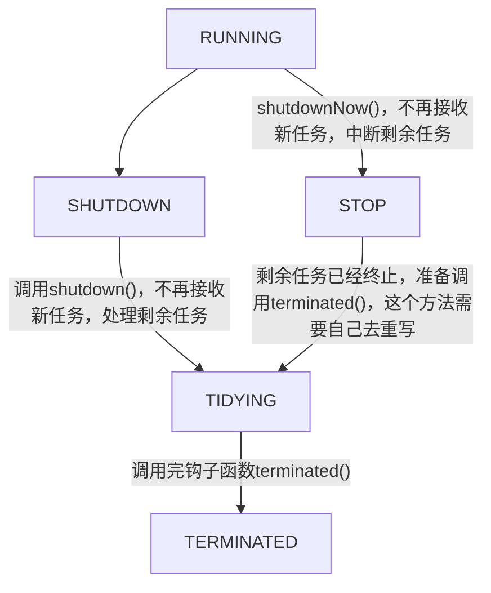

## 为什么使用线程池
* 将执行机制和工作单元分离
* 减少创建和销毁线程对象的开销
* 可控性强，可对线程池进行配置，监控
* 可扩展性强，如优先级，可延迟，定时线程池
## 用法

## 流程
<details>

<summary>展开</summary>



</details>

## 部分源码

### ThreadPoolExecutor
<details>

<summary>展开</summary>

```java title="execute"
    public void execute(Runnable command) {
        if (command == null)
            throw new NullPointerException();
        /*
         * Proceed in 3 steps:
         *
         * 1. If fewer than corePoolSize threads are running, try to
         * start a new thread with the given command as its first
         * task.  The call to addWorker atomically checks runState and
         * workerCount, and so prevents false alarms that would add
         * threads when it shouldn't, by returning false.
         *
         * 2. If a task can be successfully queued, then we still need
         * to double-check whether we should have added a thread
         * (because existing ones died since last checking) or that
         * the pool shut down since entry into this method. So we
         * recheck state and if necessary roll back the enqueuing if
         * stopped, or start a new thread if there are none.
         *
         * 3. If we cannot queue task, then we try to add a new
         * thread.  If it fails, we know we are shut down or saturated
         * and so reject the task.
         */
        int c = ctl.get();
        // 小于核心线程，尝试添加线程
        if (workerCountOf(c) < corePoolSize) {
            if (addWorker(command, true))
                return;
            c = ctl.get();
        }
        // offer 不阻塞的那个，尝试加入队列
        if (isRunning(c) && workQueue.offer(command)) {
            int recheck = ctl.get();
            // double-check 如果线程池停了，移除，并拒绝
            if (! isRunning(recheck) && remove(command))
                reject(command);
            else if (workerCountOf(recheck) == 0)
                addWorker(null, false);
        }
        // 无法排队，check最大线程数，开新线程
        else if (!addWorker(command, false))
            reject(command);
    }
```
```java title="addWorker"
    /**
     * 尝试创建新线程
     *   
     * 
     * Checks if a new worker can be added with respect to current
     * pool state and the given bound (either core or maximum). If so,
     * the worker count is adjusted accordingly, and, if possible, a
     * new worker is created and started, running firstTask as its
     * first task. This method returns false if the pool is stopped or
     * eligible to shut down. It also returns false if the thread
     * factory fails to create a thread when asked.  If the thread
     * creation fails, either due to the thread factory returning
     * null, or due to an exception (typically OutOfMemoryError in
     * Thread.start()), we roll back cleanly.
     *
     * @param firstTask the task the new thread should run first (or
     * null if none). Workers are created with an initial first task
     * (in method execute()) to bypass queuing when there are fewer
     * than corePoolSize threads (in which case we always start one),
     * or when the queue is full (in which case we must bypass queue).
     * Initially idle threads are usually created via
     * prestartCoreThread or to replace other dying workers.
     *
     * @param core if true use corePoolSize as bound, else
     * maximumPoolSize. (A boolean indicator is used here rather than a
     * value to ensure reads of fresh values after checking other pool
     * state).
     * @return true if successful
     */
    private boolean addWorker(Runnable firstTask, boolean core) {
        retry:
        for (;;) {
            int c = ctl.get();
            int rs = runStateOf(c);

            // Check if queue empty only if necessary.
            if (rs >= SHUTDOWN &&
                ! (rs == SHUTDOWN &&
                   firstTask == null &&
                   ! workQueue.isEmpty()))
                return false;

            for (;;) {
                int wc = workerCountOf(c);
                // 数量达到上限
                if (wc >= CAPACITY ||
                    wc >= (core ? corePoolSize : maximumPoolSize))
                    return false;
                // cas增加线程数   成功就跳出循环             
                if (compareAndIncrementWorkerCount(c))
                    break retry;
                c = ctl.get();  // Re-read ctl
                // 状态发生变化，重新循环
                if (runStateOf(c) != rs)
                    continue retry;
                // else CAS failed due to workerCount change; retry inner loop
            }
        }
        // 成功+1之后
        boolean workerStarted = false;
        boolean workerAdded = false;
        Worker w = null;
        try {
            w = new Worker(firstTask);
            final Thread t = w.thread;
            if (t != null) {
                final ReentrantLock mainLock = this.mainLock;
                mainLock.lock();
                // 尝试加入到workers
                try {
                    // Recheck while holding lock.
                    // Back out on ThreadFactory failure or if
                    // shut down before lock acquired.
                    int rs = runStateOf(ctl.get());

                    if (rs < SHUTDOWN ||
                        (rs == SHUTDOWN && firstTask == null)) {
                        if (t.isAlive()) // precheck that t is startable
                            throw new IllegalThreadStateException();
                        workers.add(w);
                        int s = workers.size();
                        if (s > largestPoolSize)
                            largestPoolSize = s;
                        workerAdded = true;
                    }
                } finally {
                    mainLock.unlock();
                }
                // 线程启动
                if (workerAdded) {
                    t.start();
                    workerStarted = true;
                }
            }
        } finally {
            if (! workerStarted)
                addWorkerFailed(w);
        }
        return workerStarted;
    }
```
```java title="runWorker run的委托方法"
    final void runWorker(Worker w) {
        Thread wt = Thread.currentThread();
        Runnable task = w.firstTask;
        w.firstTask = null;
        w.unlock(); // allow interrupts
        boolean completedAbruptly = true;
        try {
            while (task != null || (task = getTask()) != null) {
                w.lock();
                // If pool is stopping, ensure thread is interrupted;
                // if not, ensure thread is not interrupted.  This
                // requires a recheck in second case to deal with
                // shutdownNow race while clearing interrupt
                if ((runStateAtLeast(ctl.get(), STOP) ||
                     (Thread.interrupted() &&
                      runStateAtLeast(ctl.get(), STOP))) &&
                    !wt.isInterrupted())
                    wt.interrupt();
                try {
                    beforeExecute(wt, task);
                    Throwable thrown = null;
                    try {
                        task.run();
                    } catch (RuntimeException x) {
                        thrown = x; throw x;
                    } catch (Error x) {
                        thrown = x; throw x;
                    } catch (Throwable x) {
                        thrown = x; throw new Error(x);
                    } finally {
                        afterExecute(task, thrown);
                    }
                } finally {
                    task = null;
                    w.completedTasks++;
                    w.unlock();
                }
            }
            completedAbruptly = false;
        } finally {
            processWorkerExit(w, completedAbruptly);
        }
    }
```
</details>

## 状态
<details>

<summary>展开</summary>


</details>

## 参数

### corePoolSize
    核心线程数，线程池中始终维护的，存活的线程数，核心线程数,核心线程一旦创建就不销毁
    存活是指不断调用阻塞队列的take方法，如果队列里也没有值就会阻塞
### maximumPoolSize
    最大线程数，在corePooSize已满、队列也满的情况下，扩充线程至此值。
### keepAliveTime
    最大线程数可以存活的时间，当线程中没有任务执行时，最大线程就会销毁一部分，最终保持核心线程数量的线程。
### unit:
    单位
### workQueue（BlockingQueue）：
    阻塞队列，当新任务来的时候会先判断当前运行的线程数量是否达到核心线程数，如果达到的话，任务就会被存放在队列中。
* BlockingQueue\<Runnable>：
  * put和take：阻塞式的
* ArrayBlockingQueue ：是一个用数组实现的环形队列，在构造函数中，会要求传入数组的容量
* LinkedBlockingQueue：是一种基于单向链表的阻塞队列。
  * 可以无界
* PriorityQueue：是按照元素的优先级从小到大出队列的二叉堆。正因为如此，PriorityQueue中的2个元素之间需要可以比较大小，并实现Comparable接口（在构造方法传比较器），当元素个数超出数组长度时，执行扩容操作。
* DelayQueue：即延迟队列，也就是一个按延迟时间从小到大出队的PriorityQueue。
* **SynchronousQueue**：一个不存储元素的阻塞队列
  * 相当于把元素先存在调用线程的堆栈中
  * put和take：会阻塞调用线程，知道有对应的存或取操作
  * offer和poll：如果有对应的存取操作在等待，则消费完返回true，如果没有就直接返回false
    * 仅使用无法阻塞的offer和poll，是无效的，都会失败
  * 直接转发给maxPoolSize策略
* LinkedTransferQueue：一个由链表结构组成的无界阻塞队列。与SynchronousQueue类似，还含有非阻塞方法。
* LinkedBlockingDeque：一个由链表结构组成的双向阻塞队列。
### threadFactory
    线程工厂，主要用来创建线程，默认为正常优先级、非守护线程。
### handler
    线程池任务队列超过 maxinumPoolSize 之后的拒绝策略
*   AbortPolicy：拒绝并抛出异常。
*   CallerRunsPolicy：使用当前调用的线程来执行此任务。
*   DiscardOldestPolicy：抛弃队列头部（最旧）的一个任务，并执行当前任务。
*   DiscardPolicy：忽略并抛弃当前任务。


## 几种Executor
### ForkJoinPool
### ScheduledThreadPoolExecutor
### Executors大家庭
> 工具类，调用的ThreadPoolExecutor,ForkJoinPool的构造函数
#### FixedThreadPool
  > 可配置的，固定大小的，无界队列的
  * corePoolSize
    * nThreads 固定大小（fixed），线程数有上限
  * maximumPoolSize
    * nThreads 没啥用，反正会进队列
  * keepAliveTime
  * workQueue
    * LinkedBlockingQueue 无界的，多出来的会一直塞到队列
  * handler
    * AbortPolicy 没有触发条件
#### SingleThreadScheduled
  > 只有一个线程，固定大小的，无界队列的
  * corePoolSize
    * 1 最多就一个线程
  * maximumPoolSize
    * 1 没啥用，反正会进队列
  * keepAliveTime
  * workQueue
    * LinkedBlockingQueue 无界的，多出来的会一直塞到队列
  * handler
    * AbortPolicy 没有触发条件
#### CachedThreadPool
> 只有一个线程，固定大小的，无界队列的
* corePoolSize
  * 0
* maximumPoolSize
  * Integer.MAX_VALUE
* keepAliveTime
  * 60s
* workQueue
  * SynchronousQueue
* handler
  * AbortPolicy 没有触发条件
#### WorkStealingPool


#### ScheduledThreadPool
