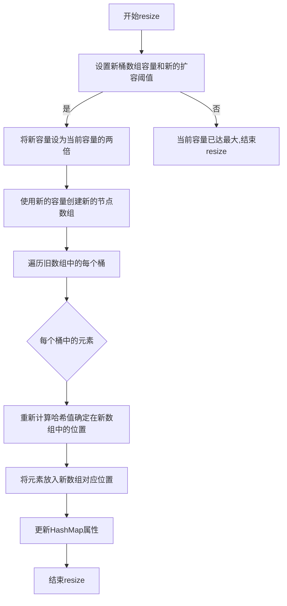

> extends AbstractMap\<K,V> implements Map\<K,V>, Cloneable, Serializable

* #### 容器实体

```java
    // 桶数组
    transient Node<K,V>[] table;
  ```

* #### 参数字段和静态常数

<details>

  <summary>展开</summary>


  * ###### loadFactor

    * 负载因子，默认0.75

    * 负载因子越高时间效率越低，空间效率越高

    * 表示预期的每个桶的元素的平均数量

    * 因为hash会发生碰撞、分布不均匀，如果这个值接近1，那就说明有些桶的元素大于1，需要用到链表或者树，查询效率就不是O(1)了

  * ###### tableLength

    * 桶数组（表）的长度

  * ###### threshold

    * 当前允许最大的容量（节点的个数）：tableLength*loadFactor

  * ###### size

    * 键值对，节点个数

  * ######  modCount

    * 记录HashMap内部结构发生变化的次数

  * ###### DEFAULT_LOAD_FACTOR = 0.75f

    * 默认负载因子，当元素个数大于0.75*桶长度时扩容

  * ###### TREEIFY_THRESHOLD = 8

    * 链表树化的阈值，大于8树化

  * ###### DEFAULT_INITIAL_CAPACITY = 1 \<< 4; // aka 16

    * 初始化的桶长度

  * ######  MIN_TREEIFY_CAPACITY = 64;

    * 最小树化容量，树化时如果桶长度\<64要先扩容，不树化

</details>


### 散列方法


* #### 一般思路


  直接把hash值对数组长度取模


* #### 优化


  * 对取模运算：


  当length为n的2次方时，h & (length -1) 相当于h%length


* #### 实现


```java
    // 1.8
    static final int hash(Object key) {
        int h;
        return (key == null) ? 0 : (h = key.hashCode()) ^ (h >>> 16);
    }
```


### 扩容


* #### 倍数：2n
```java
    final Node<K,V>[] resize() {
            ...
            else if ((newCap = oldCap << 1) < MAXIMUM_CAPACITY &&
                     oldCap >= DEFAULT_INITIAL_CAPACITY)
            ...
        }
    }
```

* #### 流程图
<details>

  <summary>展开</summary>


</details>

<details>
    <summary>展开</summary>

* ### 源码
```java
    /**
     * @from 1.8
     * Initializes or doubles table size.  If null, allocates in
     * accord with initial capacity target held in field threshold.
     * Otherwise, because we are using power-of-two expansion, the
     * elements from each bin must either stay at same index, or move
     * with a power of two offset in the new table.
     *
     * @return the table
     */
    final Node<K,V>[] resize() {
        // 先确定下来 newCap 和 newThr
        // newCap:扩容之后table数组大小
        // newThr:下次需要扩容table时数组大小 (new threshold)
        Node<K,V>[] oldTab = table;
        int oldCap = (oldTab == null) ? 0 : oldTab.length;
        int oldThr = threshold;
        int newCap, newThr = 0;
        if (oldCap > 0) {
            if (oldCap >= MAXIMUM_CAPACITY) {
                threshold = Integer.MAX_VALUE;
                return oldTab;
            }
            else if ((newCap = oldCap << 1) < MAXIMUM_CAPACITY &&
                     oldCap >= DEFAULT_INITIAL_CAPACITY)
                newThr = oldThr << 1; // double threshold
        }
        else if (oldThr > 0) // initial capacity was placed in threshold
            newCap = oldThr;
        else {               // zero initial threshold signifies using defaults
            newCap = DEFAULT_INITIAL_CAPACITY;
            newThr = (int)(DEFAULT_LOAD_FACTOR * DEFAULT_INITIAL_CAPACITY);
        }
        if (newThr == 0) {
            float ft = (float)newCap * loadFactor;
            newThr = (newCap < MAXIMUM_CAPACITY && ft < (float)MAXIMUM_CAPACITY ?
                      (int)ft : Integer.MAX_VALUE);
        }
        threshold = newThr;
        @SuppressWarnings({"rawtypes","unchecked"})
        Node<K,V>[] newTab = (Node<K,V>[])new Node[newCap];
        table = newTab;
        if (oldTab != null) {
            for (int j = 0; j < oldCap; ++j) {
                Node<K,V> e;
                if ((e = oldTab[j]) != null) {
                    oldTab[j] = null;
                    if (e.next == null)
                        newTab[e.hash & (newCap - 1)] = e;
                    else if (e instanceof TreeNode)
                        ((TreeNode<K,V>)e).split(this, newTab, j, oldCap);
                    else { // preserve order
                        Node<K,V> loHead = null, loTail = null;
                        Node<K,V> hiHead = null, hiTail = null;
                        Node<K,V> next;
                        do {
                            next = e.next;
                            if ((e.hash & oldCap) == 0) {
                                if (loTail == null)
                                    loHead = e;
                                else
                                    loTail.next = e;
                                loTail = e;
                            }
                            else {
                                if (hiTail == null)
                                    hiHead = e;
                                else
                                    hiTail.next = e;
                                hiTail = e;
                            }
                        } while ((e = next) != null);
                        if (loTail != null) {
                            loTail.next = null;
                            newTab[j] = loHead;
                        }
                        if (hiTail != null) {
                            hiTail.next = null;
                            newTab[j + oldCap] = hiHead;
                        }
                    }
                }
            }
        }
        return newTab;
    }
```

</details>

### Q&A


1. #### 和HashTable的异同


  > `HashMap` 和 `Hashtable` 都是 Java 中的数据结构，用于存储键值对。它们都实现了 `Map` 接口


###### 相同点：


*  **基础功能**：它们都提供了基础的 `Map` 功能，如 `put()`, `get()`, `remove()`, `containsKey()`, 等。


*  **内部实现**：它们都使用哈希表作为内部数据结构来存储键值对。


###### 不同点：


*  **线程安全性**：


   -   `Hashtable` 是线程安全的，它的大多数方法都是同步的，这意味着同一时间只有一个线程可以访问它的实例。


   -   `HashMap` 则不是线程安全的。如果需要在并发环境中使用 `HashMap`，你可能需要考虑使用 `Collections.synchronizedMap()` 或 `ConcurrentHashMap`。


*  **允许 null 值**：


   -   `HashMap` 允许一个 null 键和多个 null 值。


   -   `Hashtable` 不允许 null 键或 null 值。


*  **继承的类**：


   -   `HashMap` 继承自 `AbstractMap` 类。


   -   `Hashtable` 继承自 `Dictionary`(已经过时) 类。


*  **性能**：


   -   由于 `Hashtable` 的同步特性，当不需要线程安全时，`HashMap` 通常比 `Hashtable` 有更好的性能。


*  **遍历**：


   -   `HashMap` 使用 `iterator` 来遍历键值对。


   -   `Hashtable` 使用 `enumerator` 或 `iterator`。但 `iterator` 是Java 2之后才加入的。


* **初始容量和加载因子**：


      -   尽管它们都有初始容量和加载因子的概念，但 `HashMap` 允许更大的灵活性。默认加载因子对于它们都是0.75，但 `HashMap` 的默认初始容量是16，而 `Hashtable` 的默认初始容量是11。


###### 结论：


>  `HashMap` 是 Java 2 (Java 1.2) 之后引入的，而 `Hashtable` 在早期版本中已经存在（`@since JDK1.0`）。随着时间的推移，`HashMap` 在大多数应用中已经替代了 `Hashtable`，尤其是当线程安全不是关键要求时。在需要线程安全的场景中，通常更推荐使用 `ConcurrentHashMap`，因为它提供了更高的并发性能。


* #### 1.7和1.8的异同


