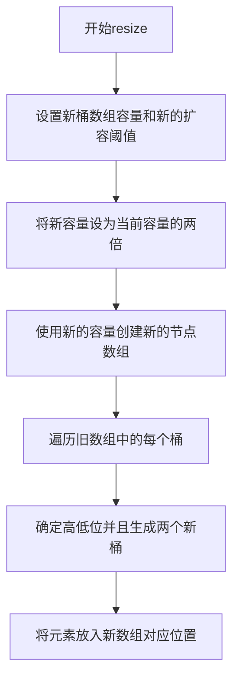

> extends AbstractMap\<K,V> implements Map\<K,V>, Cloneable, Serializable

* #### 容器实体

```java
    // 桶数组
    transient Node<K,V>[] table;
```

* #### 参数字段和静态常数

<details>

<summary>展开</summary>

* ###### loadFactor

  * 负载因子，默认0.75
  * 负载因子越高时间效率越低，空间效率越高
  * 表示预期的每个桶的元素的平均数量
  * 因为hash会发生碰撞、分布不均匀，如果这个值接近1，那就说明有些桶的元素大于1，需要用到链表或者树，查询效率就不是O(1)了
* ###### tableLength

  * 桶数组（表）的长度
* ###### threshold

  * 当前允许最大的容量（节点的个数）：tableLength*loadFactor
* ###### size

  * 键值对，节点个数
* ###### modCount

  * 记录HashMap内部结构发生变化的次数
* ###### DEFAULT_LOAD_FACTOR = 0.75f

  * 默认负载因子，当元素个数大于0.75*桶长度时扩容
* ###### TREEIFY_THRESHOLD = 8

  * 链表树化的阈值，桶的元素大于8树化
* ###### DEFAULT_INITIAL_CAPACITY = 1 \<< 4; // aka 16

  * 初始化的桶长度：16
* ###### MIN_TREEIFY_CAPACITY = 64;

  * 最小树化容量，树化时如果桶长度\<64要先扩容，不树化，防止出现很长的桶

</details>

### 散列方法

* #### 目的

   增加散列后的随机性，然后把散列后的值对数组长度取模
* #### 优化


  * ##### 计算散列的方式

     一般是用取模运算：h%length。但是在hashmap中，length为n的2次方时，所以 h & (length -1) 相当于h%length

   :::warning[原因和带来的问题]

   length是2的倍数：二进制就是 100...  
   length-1 就是掩码011...
   任意数 1xxx(n) % 100(m) 的结果就是 1xxx(m) % 100(m) , 只考虑了**m个低位**

   <details>

   <summary>二进制取模的例子：11101%100 </summary>


   * 从左侧开始，找到一个大于或等于除数 100 的数字。在这里，我们首先考虑 111。


  * 将 111 除以 100。结果为 1，余数为 11。


  * 将下一个位数 0 拉下来，得到 110。


  * 再次将 110 除以 100。结果为 1，余数为 10。


  * 最后，将最后一个位数 1 拉下来，得到 101。


  * 将 101 除以 100。结果为 1，余数为 1。


   </details>

   :::

  * ##### 取模方式
     因为考虑了低位，所以用 ` (h = key.hashCode()) ^ (h >>> 16)` 让高位也参与计算


1. #### 实现

```java
    // 1.8
    static final int hash(Object key) {
        int h;
        return (key == null) ? 0 : (h = key.hashCode()) ^ (h >>> 16);
    }
```

### 扩容

* #### 倍数：2n

```java
    final Node<K,V>[] resize() {
            ...
            else if ((newCap = oldCap << 1) < MAXIMUM_CAPACITY &&
                     oldCap >= DEFAULT_INITIAL_CAPACITY)
            ...
        }
    }
```

* #### 1.8的索引重新计算
  假设当前的length为2^m
  当length扩大一倍时，2^m -> 2^(m+1)
  此时的模数要么是01xxx 要么是11xxx  (xxx有m-1个)
  即：要么是index 要么是index + 2^m
  > 举个例子  
  length为 4 (100) , h 为 14(1110) , 当length扩大一倍时， 100 -> 1000  
  模数从010 变成 110 , 即 010+100

* #### 流程图

<details>

<summary>展开</summary>



</details>

* #### 源码

<details>
    <summary>1.8</summary>

```java
    /**
     * @from 1.8
     * Initializes or doubles table size.  If null, allocates in
     * accord with initial capacity target held in field threshold.
     * Otherwise, because we are using power-of-two expansion, the
     * elements from each bin must either stay at same index, or move
     * with a power of two offset in the new table.
     *
     * @return the table
     */
    final Node<K,V>[] resize() {
        // 先确定下来 newCap 和 newThr
        // newCap:扩容之后table数组大小
        // newThr:下次需要扩容table时数组大小 (new threshold)
        Node<K,V>[] oldTab = table;
        int oldCap = (oldTab == null) ? 0 : oldTab.length;
        int oldThr = threshold;
        int newCap, newThr = 0;
        if (oldCap > 0) {
            if (oldCap >= MAXIMUM_CAPACITY) {
                threshold = Integer.MAX_VALUE;
                return oldTab;
            }
            else if ((newCap = oldCap << 1) < MAXIMUM_CAPACITY &&
                     oldCap >= DEFAULT_INITIAL_CAPACITY)
                newThr = oldThr << 1; // double threshold
        }
        else if (oldThr > 0) // initial capacity was placed in threshold
            newCap = oldThr;
        else {               // zero initial threshold signifies using defaults
            newCap = DEFAULT_INITIAL_CAPACITY;
            newThr = (int)(DEFAULT_LOAD_FACTOR * DEFAULT_INITIAL_CAPACITY);
        }
        if (newThr == 0) {
            float ft = (float)newCap * loadFactor;
            newThr = (newCap < MAXIMUM_CAPACITY && ft < (float)MAXIMUM_CAPACITY ?
                      (int)ft : Integer.MAX_VALUE);
        }
        threshold = newThr;
        @SuppressWarnings({"rawtypes","unchecked"})
        // 产生新的桶数组
        Node<K,V>[] newTab = (Node<K,V>[])new Node[newCap];
        table = newTab;
        if (oldTab != null) {
            //遍历旧桶
            for (int j = 0; j < oldCap; ++j) {
                Node<K,V> e;
                //找到每个桶，遍历桶（链表或者树）
                if ((e = oldTab[j]) != null) {
                    oldTab[j] = null;
                    //桶里只有一个元素
                    if (e.next == null)
                        newTab[e.hash & (newCap - 1)] = e;
                    //树的情况
                    else if (e instanceof TreeNode)
                        ((TreeNode<K,V>)e).split(this, newTab, j, oldCap);
                    else { // preserve order
                        // 低位桶
                        Node<K,V> loHead = null, loTail = null;
                        // 高位桶
                        Node<K,V> hiHead = null, hiTail = null;
                        Node<K,V> next;
                        // 1.8 不会对原桶做操作
                        do {
                            next = e.next;
                            // 判断是高位还是低位，oldCap二进制只有一个1，就判断hash的那一位是不是1
                            if ((e.hash & oldCap) == 0) {
                                // 尾插法，原桶遍历完就可以确定两个桶了
                                if (loTail == null)
                                    loHead = e;
                                else
                                    loTail.next = e;
                                loTail = e;
                            }
                            else {
                                if (hiTail == null)
                                    hiHead = e;
                                else
                                    hiTail.next = e;
                                hiTail = e;
                            }
                        } while ((e = next) != null);
                        // 插入两个高低位的桶
                        if (loTail != null) {
                            loTail.next = null;
                            newTab[j] = loHead;
                        }
                        if (hiTail != null) {
                            hiTail.next = null;
                            newTab[j + oldCap] = hiHead;
                        }
                    }
                }
            }
        }
        return newTab;
    }

```

</details>

<details>
    <summary>1.7</summary>

```java
    /**
     *@from 1.7
     * Transfers all entries from current table to newTable.
     * 头插法
     */
    void transfer(Entry[] newTable, boolean rehash) {
        int newCapacity = newTable.length;
        //  table 以及每个桶 是线程共享的
        for (Entry<K,V> e : table) {
            while(null != e) {
                //取出下一个
                Entry<K,V> next = e.next;
                //这个地方e.next 可能会变，因为原桶的head会一个一个变少
                if (rehash) {
                    e.hash = null == e.key ? 0 : hash(e.key);
                }
                //计算当前的index
                int i = indexFor(e.hash, newCapacity);
                //把找到的桶放到当前的下一个
                e.next = newTable[i];
                // 把当前拼接的桶放到预期位置
                newTable[i] = e;
                e = next;
            }
        }
    }
```

</details>

### Q&A

* ### 和HashTable的异同

> `HashMap` 和 `Hashtable` 都是 Java 中的数据结构，用于存储键值对。它们都实现了 `Map` 接口

  * ###### 相同点：
  
   >  **基础功能**：它们都提供了基础的 `Map` 功能，如 `put()`, `get()`, `remove()`, `containsKey()`, 等。  
      **内部实现**：它们都使用哈希表作为内部数据结构来存储键值对。
    
  * ###### 不同点：
  
    * **线程安全性**：
  
      - `Hashtable` 是线程安全的，它的大多数方法都是同步的，这意味着同一时间只有一个线程可以访问它的实例。
      - `HashMap` 则不是线程安全的。如果需要在并发环境中使用 `HashMap`，你可能需要考虑使用 `Collections.synchronizedMap()` 或 `ConcurrentHashMap`。
    * **允许 null 值**：
  
        - `HashMap` 允许一个 null 键和多个 null 值。
        - `Hashtable` 不允许 null 键或 null 值。
    * **继承的类**：
  
        - `HashMap` 继承自 `AbstractMap` 类。
        - `Hashtable` 继承自 `Dictionary`(已经过时) 类。
    * **性能**：
  
        - 由于 `Hashtable` 的同步特性，当不需要线程安全时，`HashMap` 通常比 `Hashtable` 有更好的性能。
    * **遍历**：
  
        - `HashMap` 使用 `iterator` 来遍历键值对。
        - `Hashtable` 使用 `enumerator` 或 `iterator`。但 `iterator` 是Java 2之后才加入的。
    * **初始容量和加载因子**：
  
        -   尽管它们都有初始容量和加载因子的概念，但 `HashMap` 允许更大的灵活性。默认加载因子对于它们都是0.75，但 `HashMap` 的默认初始容量是16，而 `Hashtable` 的默认初始容量是11。
*  ###### 结论：
  
    >     `HashMap` 是 Java 2 (Java 1.2) 之后引入的，而 `Hashtable` 在早期版本中已经存在（`@since JDK1.0`）。随着时间的推移，`HashMap` 在大多数应用中已经替代了 `Hashtable`，尤其是当线程安全不是关键要求时。在需要线程安全的场景中，通常更推荐使用 `ConcurrentHashMap`，因为它提供了更高的并发性能。  
  
<br/>

* ### 1.7和1.8的异同
  * **扩容**：  
  
    1.7每次都重新计算索引，1.8判断高低位来确定索引。1.7采用头插法，每个节点都要移动原来的桶，导致了元素的反序，1.8是先确定两个桶然后直接插入  
    不考虑树化的情况，1.7动了原桶，原桶是现成共享的。1.8采用了两个链表，没有操作原桶
  * **数据结构**：

    1.8引入了红黑树，使得hash分布不均的时候查询效果更好
