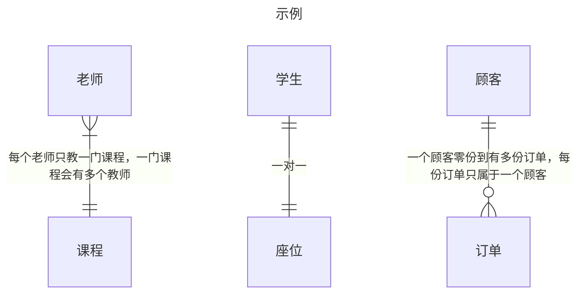
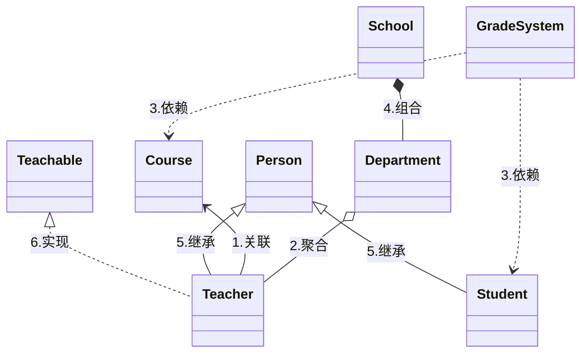

## Crow's Foot Notation


* 分为零，一和多的三种关系
* 一个方向会有两种关系AB，表示最小A关系最大B关系

| 符号  | 含义  |
|---|---|
| o   | 零  |
| \| | 一  |
| \{  | 多  |


## UML
### 目录
1. [类图](#类图)
2. [用例图](#用例图)
3. [状态图](#状态图)
4. [时序图](#时序图)
### 类图
### 关系的表示：

| 序号| 表示  | 关系  |解析|箭头指向的语义（A到B）|
|---|---|---|---|---|
| 1| -->   | 关联 Association   |类之间存在关系|A被B关联|
| 2| o-- |  聚合 Aggregation   |关联的一种变体，具有整体和部分的概念，但是部分可以独立存在，和关联的实现一样|A聚合成B，A是B的一部分|
| 3| ..>  | 依赖 Dependency    |更弱的关联，可能不是成员变量，而是函数参数|A依赖B，A需要B|
| 4| *--  | 组合 Composition   |关联的一种变体，具有整体和部分的概念，但是不部分可以独立存在，更强的聚合，控制着被聚合元素的生命周期|A组合成B，A是B的一部分|
| 5| \<\|--  | 泛化/继承 Generalization/Inheritance   |接口实现|A继承了B|
| 6| ..\|>  | 实现 Implementation   |父类和子类的关系|A实现了B|



```java
// 1. 继承关系示例（is-a）
public abstract class Person {
    protected String name;
    protected int age;

    public Person(String name, int age) {
        this.name = name;
        this.age = age;
    }
}

// Student继承自Person
public class Student extends Person {
    private int studentId;

    public Student(String name, int age, int studentId) {
        super(name, age);
        this.studentId = studentId;
    }
}

// 2. 实现关系示例（implements）
public interface Teachable {
    void teach();
}

// Teacher实现Teachable接口
public class Teacher extends Person implements Teachable {
    private String subject;

    public Teacher(String name, int age, String subject) {
        super(name, age);
        this.subject = subject;
    }

    @Override
    public void teach() {
        System.out.println(name + " is teaching " + subject);
    }
}

// 3. 关联关系示例（association）
public class Course {
    private String courseName;
    private Teacher teacher;  // 课程与老师的关联

    public Course(String courseName, Teacher teacher) {
        this.courseName = courseName;
        this.teacher = teacher;
    }
}

// 4. 聚合关系示例（aggregation）
public class Department {
    private String name;
    private List<Teacher> teachers;  // 部门与老师是聚合关系

    public Department(String name) {
        this.name = name;
        this.teachers = new ArrayList<>();
    }

    public void addTeacher(Teacher teacher) {
        teachers.add(teacher);
    }
}

// 5. 组合关系示例（composition）
public class School {
    private final List<Department> departments;  // 学校与部门是组合关系

    public School() {
        // 部门随学校的创建而创建，随学校的销毁而销毁
        departments = new ArrayList<>();
        departments.add(new Department("Math"));
        departments.add(new Department("Science"));
    }
}

// 6. 依赖关系示例（dependency）
public class GradeSystem {
    public void recordGrade(Student student, Course course, int score) {
        // GradeSystem通过方法参数临时使用了Student和Course
        System.out.println("Recording grade for " + student.name + " in " + course);
    }
}
```
