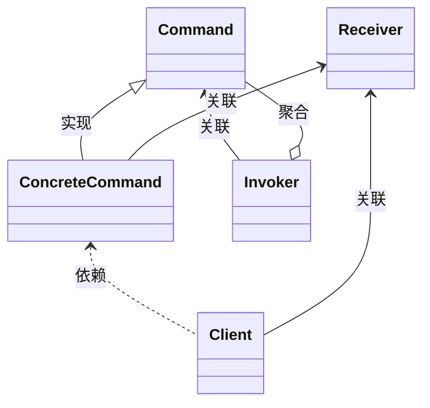

## 基本要素
* 模式名
* 问题
* 解决方案
* 效果

## 主要结构：
* 命令接口（Command）：定义一个接口，声明执行操作的抽象方法。
* 具体命令类（ConcreteCommand）：实现 Command 接口，具体执行某个操作。通常会包含对接收者对象的引用，并在执行命令时调用接收者的方法。
* 接收者（Receiver）：执行实际操作的类。具体命令通过调用接收者的相关方法来执行相应的功能。
* 调用者（Invoker）：负责调用命令对象，通常会持有命令对象的引用，并通过调用命令对象的 execute() 方法来执行命令。并不需要知道具体调用的命令
* 客户端（Client）：创建命令对象，并将其关联到调用者，同时将接收者传递给命令对象。

> Invoker调用Command，Client组织具体的ConcreteCommand，Receiver被ConcreteCommand调用

