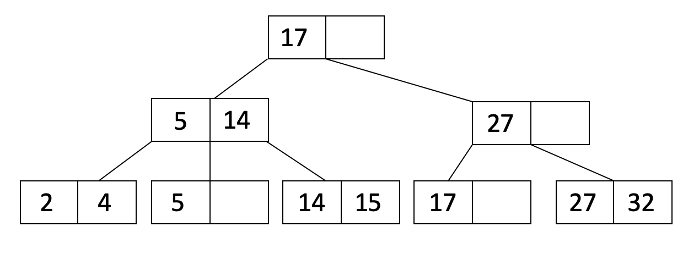

## Note4 B+Trees

### 特性
* order
> 每个除root以外的节点，order ≤ x ≤ 2order 的entities，并且entities要排序
* 每个entry （元素）之间都有一个指向子节点的引用，最多有2dorder+1个entry，也称为fanout
* 对于某个entry，其左侧子节点的keys <= entry.key <= 右侧子节点的keys
* 所有叶子节点都会处于相同的深度
### Insertion
* 步骤：
  * 找到需要插入的叶子节点，插入叶子节点
  * 如果插入后，叶子节点的keys数量超过order，则需要分裂
    * 分裂就是节点的元素数为2*order+1，需要分裂成order个和order+1个
  * 分裂之后，父节点的指针不对了，需要将分裂之后的右边那个节点的第一个元素，添加到父节点
    * 如果子节点是叶子节点，则复制
    * 如果子节点是内部节点，则移动（右边的第一个元素）
  * 插入之后，父节点的keys数量超过order，则需要分裂
  * 递归
### Deletion
* 只需要找到叶子节点然后删除，不需要删除内部节点的key
* 按照规范其实删除后需要重新平衡树的，但是因为插入比较频繁，做了简化
### Storing Records
> 如何存储records
1. 叶子节点存储数据，而非指针
   *  有个限制就是不同的索引无法使用相同的文件
2. 用引用
### Clustering
### Counting IO’s
### Bulk Loading